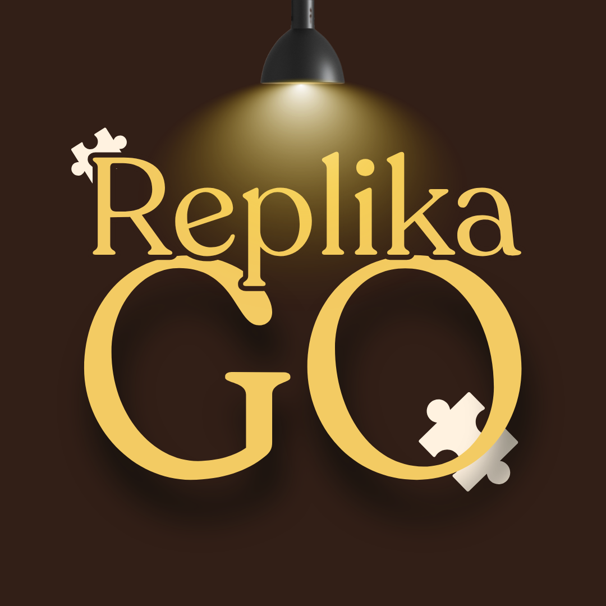

# Replika-Go

[](https://github.com/alicialisal/ReplikaGo-ARGame/graphs/contributors)

[contributors-shield]: https://img.shields.io/github/contributors/alicialisal/ReplikaGo-ARGame.svg?style=for-the-badge]

[](https://www.linkedin.com/in/alicialisal/) [](https://www.linkedin.com/in/chaidenfoanto/?locale=en) [](https://www.linkedin.com/in/dericknorlan/) [](https://www.linkedin.com/in/franklin-jaya-6a3697364/) [](https://www.linkedin.com/in/michael-christianto-s-13b1a6296/)

[linkedin-shield]: https://img.shields.io/badge/LinkedIn-0A66C2?style=for-the-badge&logo=linkedin&logoColor=white

<!-- PROJECT LOGO --> 
<p align="center">
  
</p>
<br />


<!-- TABLE OF CONTENTS -->
<details>
  <summary>Table of Contents</summary>
  <ol>
    <li>
      <a href="#about-the-project">About The Project</a>
      <ul>
        <li><a href="#built-with">Built With</a></li>
        <li><a href="#project-dependencies">Project Dependencies</a></li>
      </ul>
    </li>
    <li>
      <a href="#getting-started">Getting Started</a>
      <ul>
        <li><a href="#prerequisites">Prerequisites</a></li>
        <li><a href="#installation">Installation</a></li>
      </ul>
    </li>
    <li>
      <a href="#usage">Usage</a>
    </li>
    <li>
      <a href="#development-team">Development Team</a>
    </li>
    <li>
      <a href="#contact">Contact</a>
    </li>
  </ol>
</details>


<!-- ABOUT THE PROJECT -->
## About The Project

<p align="center">
  
</p>

This project is an educational museum game developed for the Balla Lompoa Museum to provide an interactive and immersive learning experience for visitors through gameplay and Augmented Reality (AR) technology.

The game combines historical exploration, puzzle-solving, object hunting, and AR interactions to help users learn about cultural artifacts and museum history in a more engaging way.

Main features include:

- Educational puzzle challenges
- Museum object hunting gameplay
- Interactive Augmented Reality (AR) system
- Hidden easter eggs inside the museum
- Historical learning through gamification
- Immersive exploration experience
- Historical quiz of balla lompoa

<p align="right">(<a href="#readme-top">back to top</a>)</p>

### Built With

This game project was developed using the following technologies:

[](#) [](#) [](https://developer.vuforia.com/) [](#)

<p align="right">(<a href="#readme-top">back to top</a>)</p>

### Project Dependencies

This project uses several Unity packages and supporting libraries:

- Unity 6 (6000.2.2f1)
- Vuforia Engine
- TextMeshPro
- Unity Input System
- XR Interaction Toolkit
- Blender 3D Assets

## Publication

This project was documented as part of a research and conference publication discussing the implementation of Augmented Reality (AR) technology and gamification for interactive museum education at Balla Lompoa Museum.

<p align="center">
  
</p>

### Research Title

**ReplikaGO: Digitizing the Artifacts of the Balla Lompoa Museum through Augmented Reality and Gamification**

### Research Overview

The research focuses on developing a mobile-based educational game using Augmented Reality (AR) technology to improve visitor engagement and historical learning experiences inside the museum environment.

The system integrates:

- Unity Game Engine
- Vuforia Engine
- Marker-Based and Model Target AR
- 3D Object Visualization
- Educational Puzzle System
- Gamification Mechanics

The application allows users to interact with museum artifacts through AR visualization, complete historical puzzles, search for hidden objects, and discover easter eggs inside the museum environment.

### Research Contributions

- Development of an educational AR museum game
- Interactive historical learning through gamification
- Integration of Vuforia model target technology
- Mobile-based immersive museum exploration
- 3D cultural artifact visualization
- Puzzle and object-hunting educational mechanics
- Preservation and digitalization of local cultural heritage

### Publication Link

Journal Publication:

[Research Publication](https://www.researchgate.net/publication/400532855_ReplikaGO_Digitizing_the_Artifacts_of_the_Balla_Lompoa_Museum_through_Augmented_Reality_and_Gamification)

<p align="right">(<a href="#readme-top">back to top</a>)</p>

## Getting Started

Follow these steps to set up the unity project locally

### Prerequisites

Make sure you have installed the following software:

- Unity Hub
- Unity Editor 6 (6000.2.2f1)
- Android Build Support
- Visual Studio
- Git
- Blender (optional for 3D asset editing)

Check your installation:

```sh
git --version
```

You can verify the Unity version directly from Unity Hub.

---

### Installation

1. Clone the repository

```sh
git clone https://github.com/your_username/your_repository.git
```

2. Navigate to the project folder

```sh
cd your_repository
```

3. Open the project using Unity Hub

- Open Unity Hub
- Click **Add Project**
- Select the cloned project folder

4. Install required Unity packages

Open:

```txt
Window → Package Manager
```

Make sure these packages are installed:

- Vuforia Engine
- TextMeshPro
- XR Interaction Toolkit
- Input System

5. Configure Android Build Support

Open:

```txt
File → Build Settings
```

Then select:

```txt
Android → Switch Platform
```

6. Run the project

Press the **Play** button inside the Unity Editor.

---

### Build APK

To generate an Android APK:

```txt
File → Build Settings → Build
```

The generated APK can then be installed on Android devices for AR gameplay experience.

---

## Usage

This project is a mobile-based educational museum game developed for Balla Lompoa Museum using gameplay and Augmented Reality (AR) technology.

The game combines interactive learning, puzzle-solving, artifact hunting, and AR experiences to create an immersive educational environment for museum visitors.

Main gameplay features include:

- Historical puzzle-solving gameplay
- Museum artifact hunting missions
- Interactive AR experiences using Vuforia Engine
- Easter egg discovery system
- Educational exploration inside the museum
- Marker and model target-based AR interaction
- Mobile-based gameplay experience
- 3D object visualization created using Blender

The system uses Vuforia Engine model target generation technology to recognize museum objects and trigger AR-based educational content during gameplay.

System workflow:

1. Players explore the museum environment using a mobile device
2. The game provides missions and puzzle objectives
3. Players search for hidden historical artifacts
4. Vuforia scans markers or model targets inside the museum
5. AR content and 3D objects appear when targets are recognized
6. Players complete challenges and unlock hidden easter eggs


<p align="right">(<a href="#readme-top">back to top</a>)</p>

<!-- CONTACT -->
## Contact

- Franklin Jaya - [@franklinjaya_](https://www.instagram.com/franklinjaya_/) - franklinjaya827@gmail.com - [Franklin-Github](https://github.com/FranklinJaya2006) <br>
- Chaiden Richardo Foanto - [@chaidenfoanto](https://www.instagram.com/chaidenfoanto/) - chaiden.foanto@gmail.com - [Chaiden-Github](https://github.com/chaidenfoanto) <br>
- Alicia Juanita Lisal - [@alicia_lisal](https://www.instagram.com/alicia_lisal/) - alicia.lisal94@gmail.com - [Chaiden-Github](https://github.com/alicialisal) <br>

<p align="right">(<a href="#readme-top">back to top</a>)</p>

## Development Team

This Project are developed by **Replika-Go Development Team**, which consist of five people:

1. **Alicia Lisal**
2. **Chaiden Richardo Foanto**
3. **Derick Norlan**
4. **Franklin Jaya** 
5. **Michael Christianto Sawitto** 


<!-- MARKDOWN LINKS & IMAGES -->
<!-- https://www.markdownguide.org/basic-syntax/#reference-style-links -->
[Laravel.com]: https://img.shields.io/badge/Laravel-%23FF2D20.svg?logo=laravel&logoColor=white
[Laravel-url]: https://laravel.com
